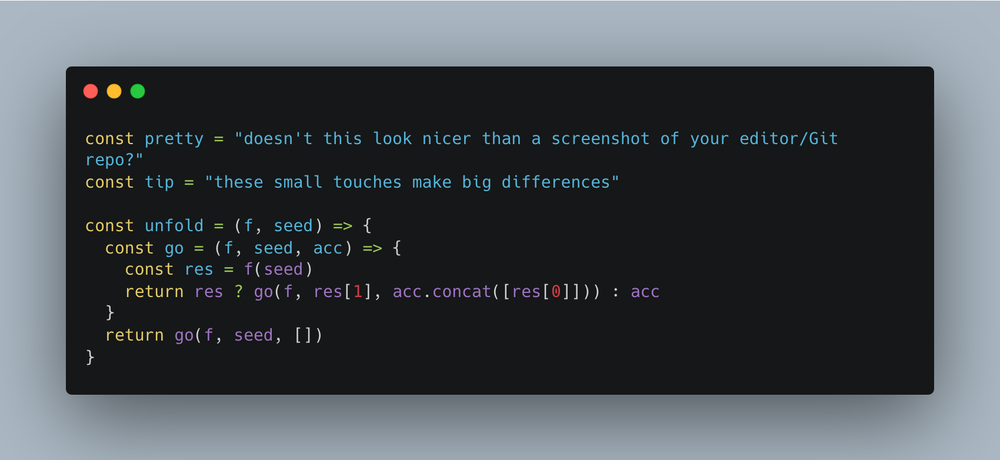
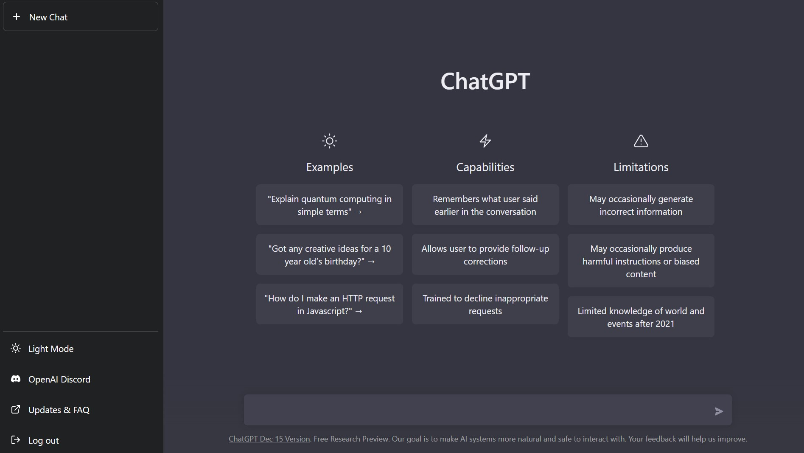

---

marp: true
theme: gaia
class: invert

---
<!-- _class: lead -->
# Preparing for a Hackathon

Chris Gwilliams
women++

---

1. Be prepared to work late into the night
2. Dress professionally
3. Ignore the diet; eat the pizza
4. Always. Be. Hacking.

---

1. Ignore the previous slide
2. Let's try that again

---

## Just Do It (For Yourself)

Hackathons have come a long way from the early days of chugging red bull and staying awake for 72 hours.

It does not mean you cannot do that but you are not going to do your best work with sleep deprivation!

Know yourself and know it is OK to check out early; you do not need to be the one to turn off the lights

---

## Be A Team and Know Your Team

- If you can make a team before: try to do that!!!

- Use Discord, Mattermost, Matrix, Signal etc to coordinate and chat

    - (It is not wrong to share ideas in a hackathon wide chat as well)

- Overcommunicate (it is better that everyone knows what you are doing; lone working is not ideal)

---

## The Solution is in the Problem

- Do not jump into code immediately

- Ignore your first thoughts (often it is in areas you know or are comfortable with)

- Look at the info available (any research/data available or interviews?)

---

## Do Not Get Stuck in a Rabbit Hole

- If it is not working, you do not have to fix it just because you have been working on it for 6 hours

- Treat the hackathon as a scratch pad for ideas and experimentation

- The best idea is not the best idea; it is the best one you can implement in a weekend

---

## Don't Just Hack

- Use the hackathon for all that it is

- Workshops, talks, **network**, eat, sleep, yoga etc

- You are giving up your time, some pressure is part of the fun 

BUT

- If it is not fun, it is not worth doing

---

## Prep and Prep Some More

- Read up on tools/tech you expect to use
    - Sign up for accounts ahead of time, [use the free tier!](https://free-for.dev/#/)

- It is not all about coding and it is not only for coders

- Design, accessibility, management etc all have roles to play

---

## Your Code Does Not Speak For Itself

- Showing source code might impress technical attendees but it rarely wins prizes

- Always. Be. Presenting.

- Start the presentation at the same time as your code

    - Note down key points as you discuss/develop

- No functionality? Does not build? FAKE IT (but not all of it)

---

## Tools

---

## Tools: Not This

---

## Tools: But This?

- [CodeGPT](https://code-gpt-docs.vercel.app/docs/tutorial-ai-providers/openai)
- [Aider](https://aider.chat/examples/hello-world-flask.html)
- [Polycoder](https://github.com/VHellendoorn/Code-LMs)
- [Pocketbase](https://pocketbase.io)
- [Supabase](https://supabase.com)

---

## We Are Here For You

- [Community](https://join.slack.com/t/womenplusplus/shared_invite/zt-1w5t7t7av-RpMRsLJ~jrc0slB2mY1Jjg)
- [Hackathon Survival Kit](https://github.com/WomenPlusPlus/hackathon-survival-kit)
- [Web](https://womenplusplus.ch)
- [Email us](mailto:hello@womenplusplus.ch)
